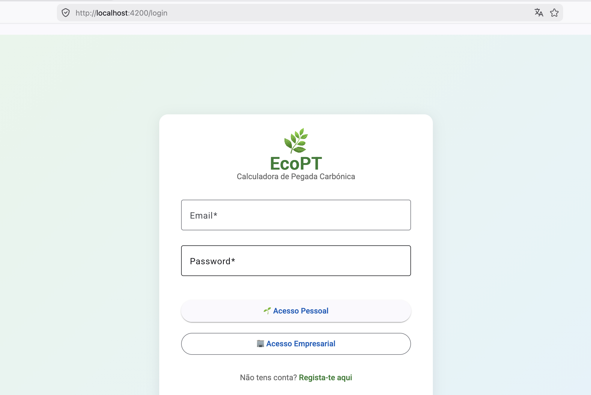

# 🌿 EcoPT — Calculadora de Pegada Carbónica


A primeira calculadora de pegada carbónica pensada especificamente para Portugal. Usa fatores de emissão portugueses (APA 2025 / DGEG Energia em Números 2025) para resultados mais precisos e relevantes.

---

## 🎯 ODS 13 — Ação Climática

Este projeto contribui para o **ODS 13 das Nações Unidas** ao consciencializar os cidadãos portugueses sobre o impacto das suas escolhas diárias no clima, e ao sugerir ações concretas de redução.

---

## 📸 Screenshot



---

## O que é o EcoPT?

A maioria das pessoas não sabe quanto CO₂ gera no dia a dia. O EcoPT calcula a tua pegada de carbono com base em:

- 🚗 Quilómetros de carro por semana
- ✈️ Voos por ano
- 🥗 Tipo de dieta
- ⚡ Consumo de energia em casa (kWh)

E compara com a média portuguesa (5.1t) e europeia (9.0t).

---

## 🛠️ Stack Tecnológica

| Camada | Tecnologia | Deploy |
|--------|-----------|--------|
| Frontend | Angular 21+ | Vercel |
| Backend | Node.js 24+ + Express | Render |
| Base de dados | Supabase (PostgreSQL) | Supabase Cloud |
| Auth | Supabase Auth (JWT) | Supabase Cloud |
| CI/CD | GitHub Actions | GitHub |

---

## 📁 Estrutura do Repositório
```
Projeto_EcoPT/
├── backend/    → API REST (Node.js + Express)
├── frontend/   → Aplicação web (Angular)
└── .github/    → Pipeline CI/CD
```

---

## 🔗 Links

- 🌐 **Aplicação em produção:** [https://projeto-eco-pt.vercel.app](https://projeto-eco-pt.vercel.app)
- 📦 **Backend API:** [backend/README.md](./backend/README.md)
- 🎯 **ODS 13:** [undp.org](https://www.undp.org/sustainable-development-goals/climate-action)

---

## ✅ Funcionalidades Implementadas

- Registo e login com email e password (Supabase Auth)
- Calculadora de pegada carbónica com fatores portugueses
- Dashboard com comparador visual (utilizador vs média PT vs média EU)
- Histórico de cálculos com editar e eliminar
- Biblioteca de dicas de redução de CO₂ (dados do Supabase)
- FAQ científico com fontes IPCC/DGEG
- Mercado Circular: publicar, explorar e mostrar interesse em itens (doação, troca, venda, empréstimo)
- Carsharing: calcular poupança CO₂, ver boleias disponíveis, reservar e oferecer boleia
- Autenticação JWT com route guard e HTTP interceptor
- Pipeline CI/CD com GitHub Actions (lint + testes + build + deploy)

---

## 🚀 Como Correr Localmente

### Pré-requisitos
- Node.js 24+
- Conta no Supabase

### Backend
```bash
cd backend
npm install
cp .env.example .env
# preenche o .env com as tuas credenciais
npm run dev
```
### Docker
```bash
cd backend
docker build -t ecopt-backend .
docker run -p 3000:3000 --env-file .env ecopt-backend
```

### Frontend
```bash
cd frontend
npm install
ng serve
```

A aplicação fica disponível em `http://localhost:4200`

---

## 🔐 Variáveis de Ambiente

Cria um ficheiro `.env` no `/backend` baseado no `.env.example`:
```env
SUPABASE_URL=your_supabase_url_here
SUPABASE_SERVICE_KEY=your_service_key_here
PORT=3000
FRONTEND_URL=http://localhost:4200
ORS_API_KEY=your_openrouteservice_api_key_here
```

> **Nunca** partilhes os valores reais. O `.env` está no `.gitignore`.

---

## 🧠 Decisão de Design

**Fatores de emissão oficiais portugueses em vez de valores europeus genéricos**

A maioria das calculadoras de CO₂ usa fatores genéricos europeus. O EcoPT usa dados específicos de Portugal:

- **Energia:** 0.25 kgCO₂e/kWh — Fator de Emissão da Eletricidade, APA 2025
- **Transporte:** 0.21 kgCO₂/km — média do parque automóvel português
- **Comparador:** média PT de 5.1 tonCO₂/hab (DGEG, Energia em Números 2025) vs média EU de 9.0 tonCO₂/hab (Eurostat 2023)

Esta decisão leva a resultados mais precisos e relevantes para utilizadores portugueses, diferenciando o EcoPT de outras calculadoras genéricas disponíveis online.

Escolhi utilizar o Angular Material para a interface por garantir componentes acessíveis e consistentes. Uma decisão técnica importante foi a implementação de uma Mobile Nav independente para garantir que utilizadores em dispositivos móveis tivessem acesso rápido ao Marketplace e Calculadora, otimizando a UX em ecrãs pequenos.
